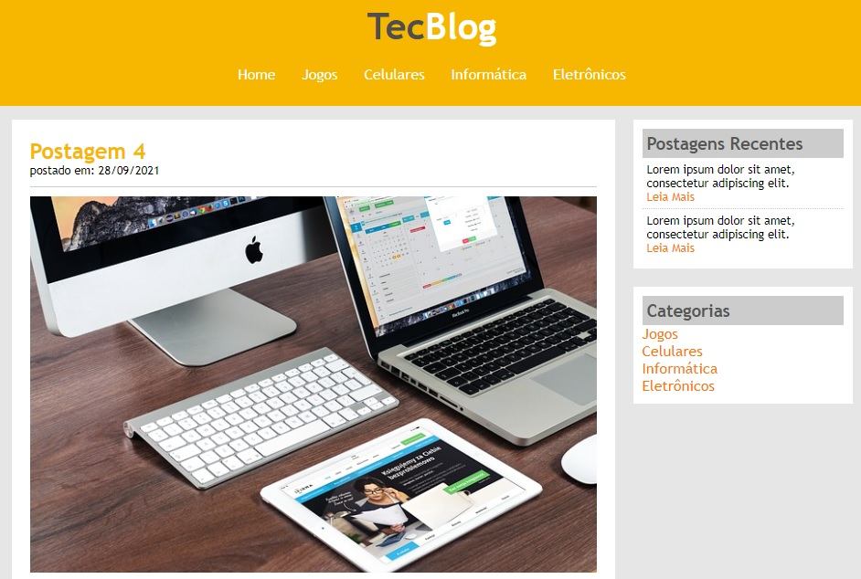

# TecBlog

Welcome! 

This repository contains my solution for a simple blog about technology to train the use of some HTML5 and CSS3 features.

This project was developed during the [Complete Web Development](https://www.udemy.com/course/web-completo/) course (Section CSS3) held at UDEMY.



# 🧠 About

The goal with this project is implement an static page using HMTL and CSS to learn and practice about this functionalities below:

- [x] Borders
- [x] Box models
- [x] Floating elements
- [x] Inline, block and inline-block
- [x] Positions (Static and relative)
- [x] Positions (Absolute and fixed)
- [x] Links
- [x] Effects
- [x] Sidebar

## 🖥️ Installation

1. Clone this repo
```bash
git clone https://github.com/robernar2011/TecBlog.git
```
